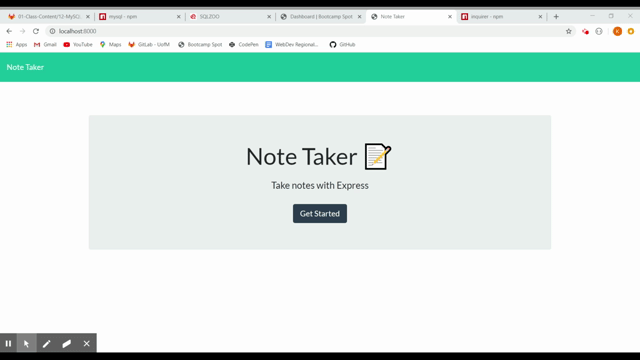

# Note-Taker
## Purpose
The purpose of the app is so that a user can keep track of their notes. The user can save information in a note and delete the note once it is no longer needed or the task in complete. 

## User Story
`AS A user, I want to be able to write and save notes
I WANT to be able to delete notes I've written before
SO THAT I can organize my thoughts and keep track of tasks I need to complete`

## How to Use
User will be brought to a homepage where they can click "Get Started" to take them to the note taking page. There, they will be able to type in a note title and input notes. Once they are done they can click the save button. That note will then be saved to the server and will remain on the left side of the screen. The user can then add more notes. If they want to remove a note they created they can do that by clicking the trash icon next to the note. 

## GIF

